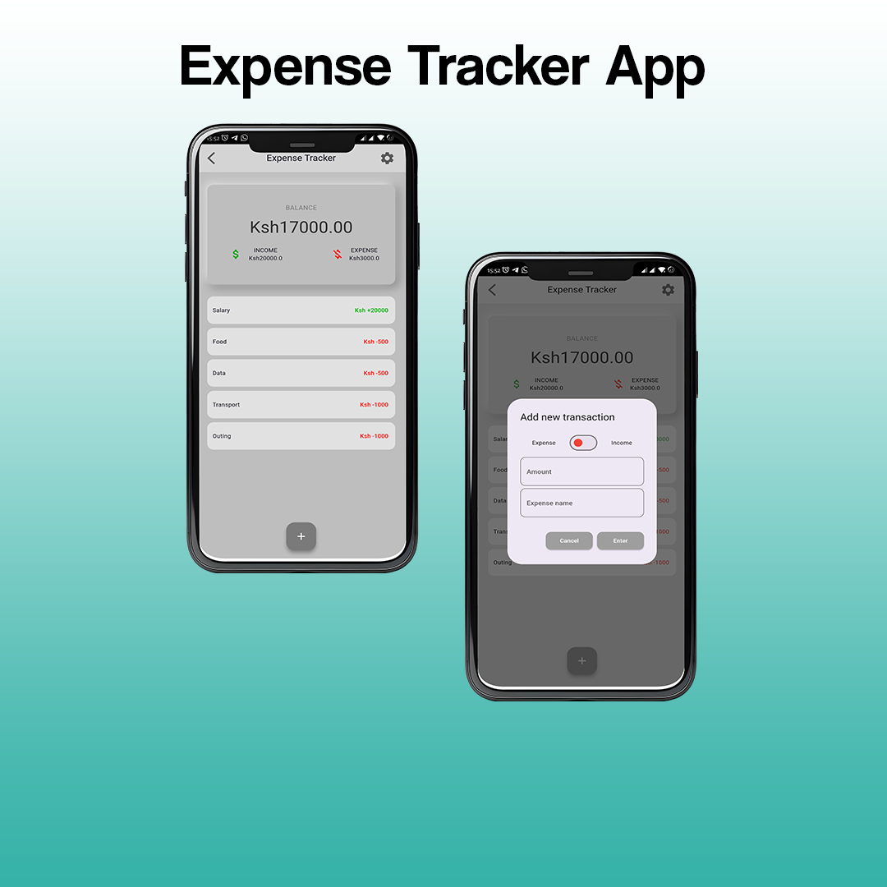
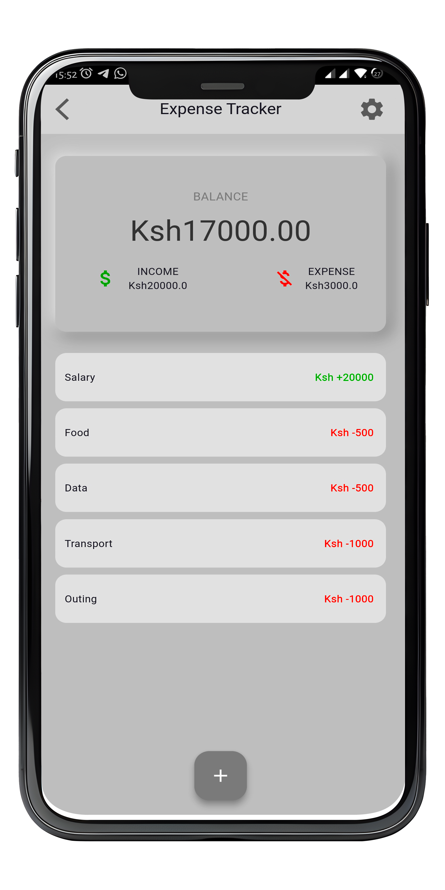
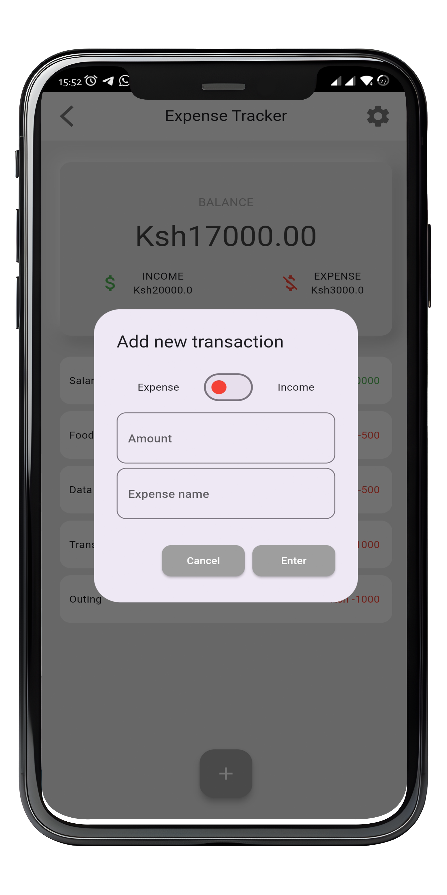

# Expense Tracker App
# Overview
The Expense Tracker App is a user-friendly mobile application built with Flutter that helps users manage their finances by tracking expenses. This app provides a simple and intuitive interface for recording, categorizing, and analyzing expenditures.

Features
Expense Logging: Record your daily expenses with details such as amount, category, and notes.

Categories: Categorize expenses to gain insights into spending patterns.

Budget Tracking: Set monthly budgets for different expense categories and monitor your spending against these budgets.

Reports and Analytics: View detailed reports and visualizations of your spending habits.

Screenshots

   
  
  <!-- Add more images as needed -->

